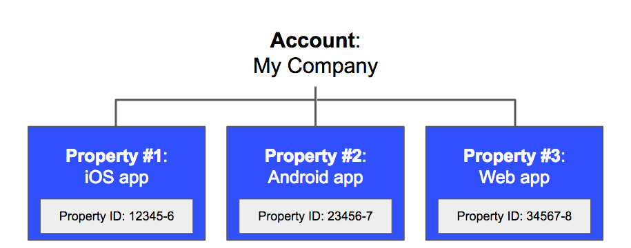
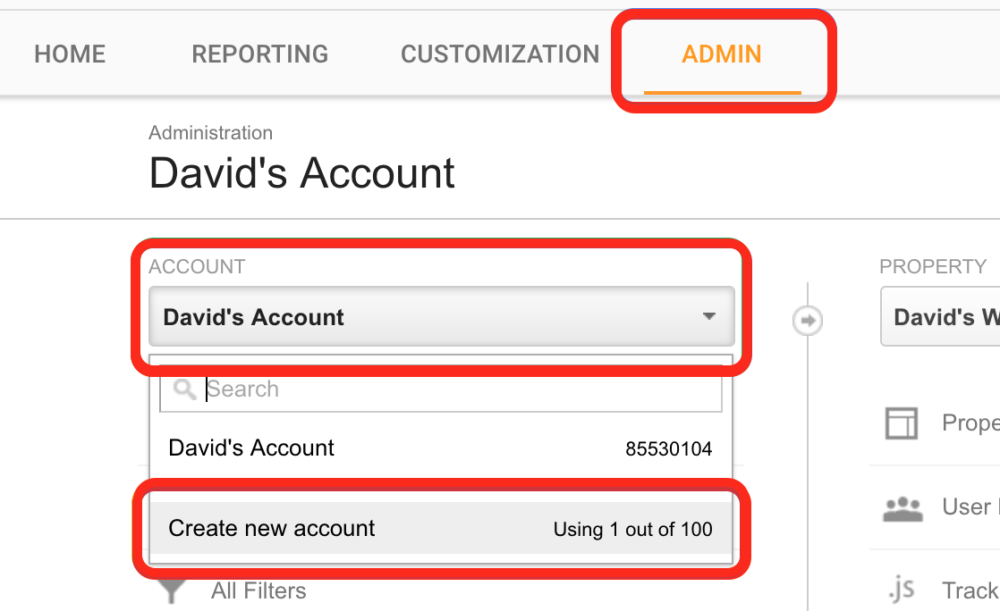
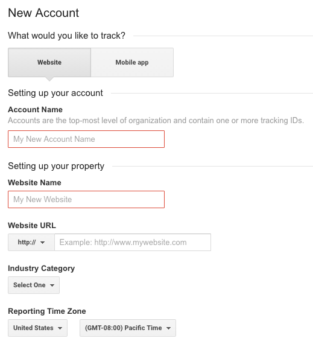
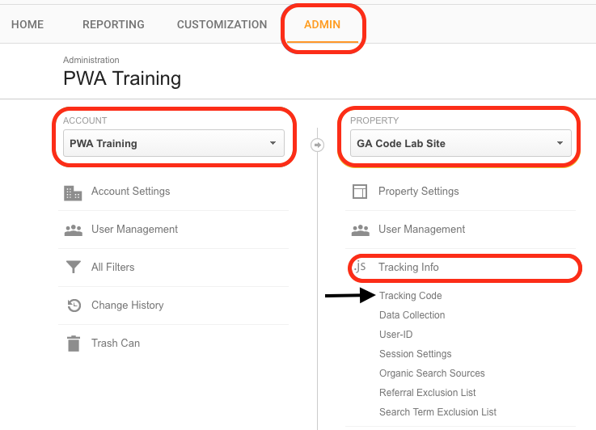
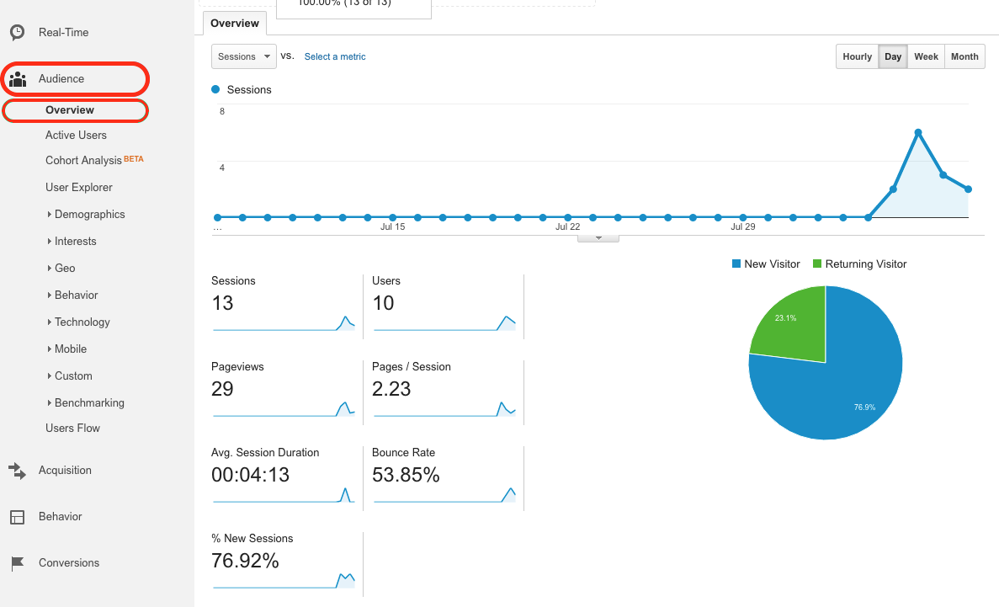
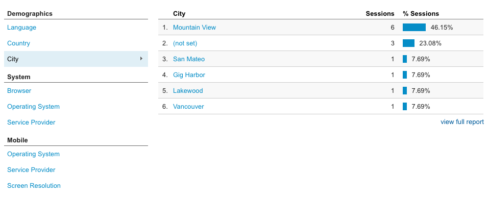
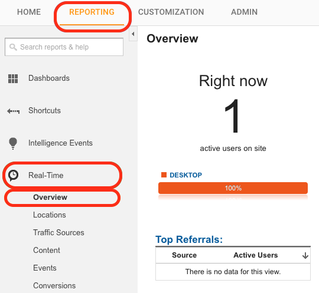
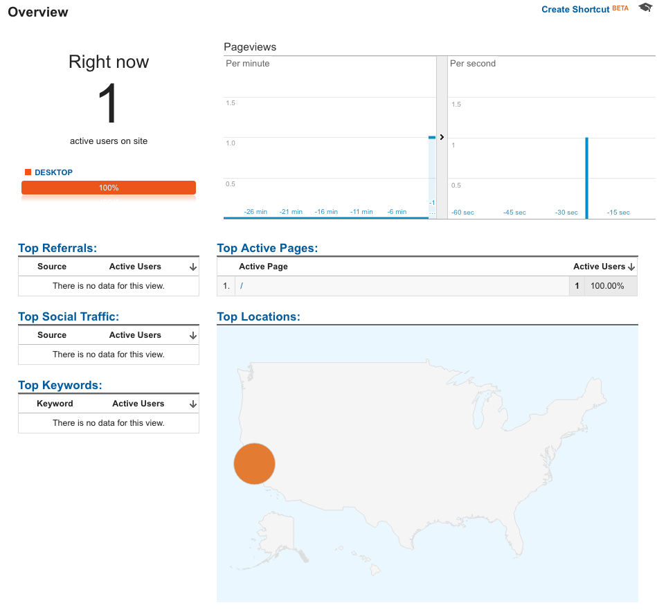
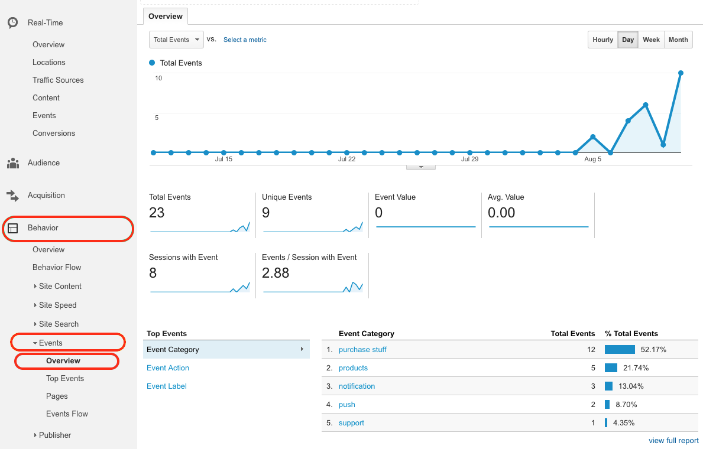
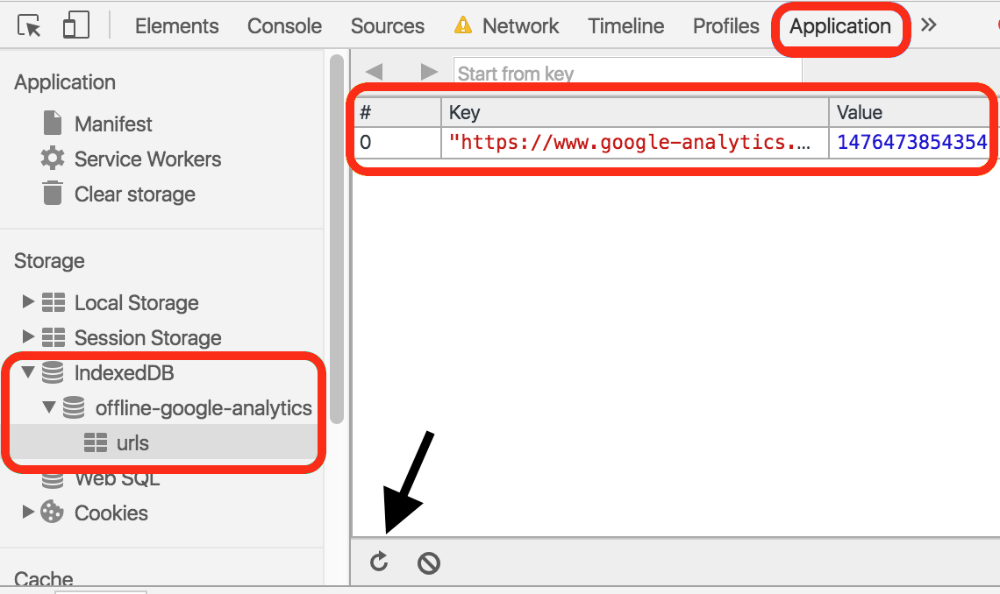

# Integrating Analytics


## Contents


<a href="#what"><strong>What is Google Analytics?</strong></a> 

<a href="#account"><strong>Creating an account</strong></a> 

<a href="#addanalytics"><strong>Add analytics to your site</strong></a> 

<a href="#dash"><strong>Google Analytics dashboard</strong></a> 

<a href="#customevents"><strong>Custom events</strong></a> 

<a href="#analyticsserviceworker"><strong>Analytics and service worker</strong></a> 

<a href="#offline"><strong>Offline analytics</strong></a> 

<a href="#resources"><strong>Further reading</strong></a>

Codelab: <a href="https://google-developer-training.gitbooks.io/progressive-web-apps-ilt-codelabs/content/docs/lab_integrating_analytics.html">Integrating Analytics</a>

<a id="what" />


## What is Google Analytics?


Google Analytics is a service that collects, processes, and reports data about an application's use patterns and performance. Adding Google Analytics to a web application enables the collection of data like visitor traffic, user agent, user's location, and so forth. This data is sent to Google Analytics servers where it is processed. The processed data is then reported to the developer and/or application owner. This information is accessible from the Google Analytics web interface (dashboard) and through the <a href="https://developers.google.com/analytics/devguides/reporting/core/v4/">reporting API</a>. 

#### Why use it?

Using analytics tools gives developers valuable information about their application such as:

* User's geographic location, user agent, screen resolution, and language
* How long users spend on pages, how often they visit pages, and the order in which pages are viewed
* What times users are visiting the site and from where they arrived at the site

Google Analytics is free, relatively simple to integrate, and customizable. 

<a id="account" />


## Creating an account


Google Analytics requires creating a Google Analytics account. An account has <a href="https://support.google.com/analytics/answer/2649554">properties</a> that represent individual collections of data. These properties have tracking IDs (also called property IDs) that identify them to Google Analytics. For example, an account might represent a company. One property in that account might represent the company's web site, while another property might represent the company's iOS app. 



If you only have one app, the simplest scenario is to create a single Google Analytics account, and add a single property to that account. That property can represent your app. 

A Google Analytics account can be created from <a href="https://analytics.google.com/">analytics.google.com</a>. 

<div class="note">
<strong>Note: </strong>The Google Analytics UI is subject to updates and may not look exactly like the screenshots presented here.
</div>

#### If you already have a Google Analytics account

Create another one. Select the <strong>Admin</strong> tab. Under <strong>account</strong>, select your current Google Analytics account and choose <strong>create new account</strong>. A single Gmail account can have multiple (currently 100) Google Analytics accounts. 



#### If you don't have a Google Analytics account

Select <strong>Sign up</strong> to begin creating your account.

The account creation screen should look like this:



#### What would you like to track? 

Websites and mobile apps implement Google Analytics differently. This document assumes a web app is being used. For mobile apps, see <a href="https://support.google.com/analytics/answer/2587086?ref_topic=2587085&rd=1">analytics for mobile applications</a>.

#### Setting up your account

This is where you can set the name for your account, for example "PWA Training" or "Company X". 

#### Setting up your property

A property must be associated with a website (for web apps). The website name can be whatever you want, for example "GA Code Lab Site" or "My New App". The website URL should be the URL where your app is hosted.

<div class="note">
<strong>Note: </strong>Analytics will still work even if this URL does not match your site. The only thing that ties analytics data to your account is the value of your <strong>tracking / property ID</strong>. The site URL that you use to create your Google Analytics account is only used for things like automated testing. 
</div>

You can set an industry category to get benchmarking information later (in other words, to compare your app with other apps in the same industry). You can set your timezone here as well. You may also see data sharing options, but these are not required.

Once you have filled in your information, choose <strong>Get Tracking ID</strong> and agree to the terms and conditions to finish creating your account and its first property. This will take you to the tracking code page where you get the tracking ID and tracking snippet for your app.

<a id="addanalytics" />


## Add analytics to your site


Once you have created an account, you need to add the tracking snippet to your app. You can find the tracking snippet with the following steps:

1. Select the <strong>Admin</strong> tab. 
2. Under <strong>account</strong>, select your account (for example "PWA Training") from the dropdown list. 
3. Then under <strong>property</strong>, select your property (for example "GA Code Lab Site") from the dropdown list. 
4. Now choose <strong>Tracking Info</strong>, and then <strong>Tracking Code</strong>. 



Your tracking ID looks like <code>UA-XXXXXXXX-Y</code> and your tracking code snippet looks like:

#### index.html
```
<script>
  (function(i,s,o,g,r,a,m){i['GoogleAnalyticsObject']=r;i[r]=i[r]||function(){(i[r].q=i[r].q||[]) \
.push(arguments)},i[r].l=1*new Date();a=s.createElement(o),m=s.getElementsByTagName(o)[0]; \
a.async=1;a.src=g;m.parentNode.insertBefore(a,m)})(window,document,'script', \
'https://www.google-analytics.com/analytics.js','ga');

  ga('create', 'UA-XXXXXXXX-Y', 'auto');
  ga('send', 'pageview');

</script>
```

Your tracking ID is embedded into your tracking snippet. This snippet needs to be embedded into every page that you want to track. 

When a page with the snippet loads, the tracking snippet script is executed. The IIFE (<a href="https://en.wikipedia.org/wiki/Immediately-invoked_function_expression">Immediately Invoked Function Expression</a>) in the script does two things:

* Creates another <code>script</code> tag that starts asynchronously downloading <strong>analytics.js</strong>, the library that does all of the analytics work. 
* Initializes a global <code>ga</code> function, called the command queue. 

The <code>ga</code> command queue is the main interface for using <strong>analytics.js</strong>. The command queue stores commands (in order) until <strong>analytics.js</strong> has loaded. Once <strong>analytics.js</strong> has loaded, the commands are executed sequentially. This functionality ensures that analytics can begin independent of the loading time of <strong>analytics.js</strong>. 

Commands are added by calling <code>ga()</code>. The first argument passed is the command itself, which is a method of the <strong>analytics.js</strong> library. The remaining arguments are parameters for that method. 

The next lines add two commands to the queue. The first creates a new <a href="https://developers.google.com/analytics/devguides/collection/analyticsjs/tracker-object-reference">tracker object</a>. Tracker objects track and store data. When the new tracker is created, the analytics library gets the user's IP address, user agent, and other page information, and stores it in the tracker. From this info Google Analytics can extract:

* User's geographic location
* User's browser and operating system (OS)
* Screen size
* If Flash or Java is installed
* The referring site

You can learn more about <a href="https://developers.google.com/analytics/devguides/collection/analyticsjs/creating-trackers">creating trackers</a> in the documentation.

The second command sends a "<a href="https://support.google.com/analytics/answer/6086082">hit</a>". This sends the tracker's data to Google Analytics. Sending a hit is also used to note a user interaction with your app. The user interaction is specified by the hit type, in this case a "pageview".  Since the tracker was created with your tracking ID, this data is sent to your account and property. You can learn more about <a href="https://developers.google.com/analytics/devguides/collection/analyticsjs/sending-hits">sending data</a> in the Google Analytics documentation.

The code so far provides the basic functionality of Google Analytics. A tracker is created and a  pageview hit is sent every time the page is visited. In addition to the data gathered by tracker creation, the pageview event allows Google Analytics to infer:

* The total time the user spends on the site
* The time spent on each page and the order in which the pages are visited
* Which internal links are clicked (based on the URL of the next pageview)

<div class="note">
<strong>Note: </strong>Tracker objects do not update themselves. If a user changes the size of the window, or if code running on the page updates the URL (such as in a single page app), tracker objects do not automatically capture this information. In order for the tracker object to reflect these changes, you must <a href="https://developers.google.com/analytics/devguides/collection/analyticsjs/accessing-trackers">manually update it</a>.
</div>

### Debugging and development

Google Analytics offers the <strong>analytics.js</strong> library with a debug mode: <strong>analytics_debug.js</strong>. Using this version will log detailed messages to the console that break down each hit sent. It also logs warnings and errors for your tracking code. To use this version, replace <strong>analytics.js</strong> with <strong>analytics_debug.js</strong> (in all instances of your tracking snippet).

<div class="note">
<strong>Note:</strong> The debug version should not be used in production as it is a much larger file. 
</div>

<div class="note">
<strong>Note:</strong> You can also use the <a href="https://chrome.google.com/webstore/detail/google-analytics-debugger/jnkmfdileelhofjcijamephohjechhna">Chrome debugger extension</a>. 
</div>

#### For more information

* <a href="https://developers.google.com/analytics/devguides/collection/analyticsjs/">Adding analytics.js to Your Site</a>
* <a href="https://developers.google.com/analytics/devguides/reporting/core/v4/">Google Reporting API v4</a>
* <a href="https://chrome.google.com/webstore/detail/google-analytics-debugger/jnkmfdileelhofjcijamephohjechhna">Google Analytics Debugger</a>
* <a href="https://developers.google.com/analytics/devguides/collection/analyticsjs/debugging">Google Analytics Debugging</a>
* <a href="https://developers.google.com/analytics/devguides/collection/analyticsjs/accessing-trackers">Getting and Setting Tracker Data</a>

<a id="dash" />


## Google Analytics dashboard


All of the data that is sent to Google Analytics can be viewed in the reporting tab of the Google Analytics dashboard (the Google Analytics web interface). For example, overview data is available by selecting <strong>Audience</strong> and then <strong>Overview</strong> (shown below).

From the overview page you can see general information such as pageview records, bounce rate, ratio of new and returning visitor, and other statistics.



You can also see specific information like visitors' language, country, city, browser, operating system, service provider, screen resolution, and device.



### Real time analytics

It's also possible to view analytics information in real time. From the same <strong>Reporting</strong> tab, select <strong>Real-Time</strong> and <strong>Overview</strong>:



If you are visiting your app in another tab or window, you should see yourself being tracked. The screen should look similar to this:



These are only the basic aspects of the Google Analytics dashboard. There is an extensive set of features and functionality. 

#### For more information

* <a href="https://analyticsacademy.withgoogle.com/">Learn about Google Analytics for business</a>

<a id="customevents" />


## Custom events


Google Analytics supports custom events that allow for fine-grain analysis of user behavior. 

For example, the following code will send a custom event:

#### main.js
```
ga('send', {
  hitType: 'event',
  eventCategory: 'products',
  eventAction: 'purchase',
  eventLabel: 'Summer products launch'
});
```

Here the hit type is set to 'event' and values associated with the event are added as parameters. These values represent the <code>eventCategory</code>, <code>eventAction</code>, and <code>eventLabel</code>. All of these are arbitrary, and used to organize events. Sending these custom events allow us to deeply understand user interactions with our site.

<div class="note">
<strong>Note:</strong> Many of the <code>ga</code> commands are flexible and can use multiple signatures. You can see all method signatures in the <a href="https://developers.google.com/analytics/devguides/collection/analyticsjs/command-queue-reference">command queue reference</a>.
</div>

Event data can be viewed in the <strong>Reporting</strong> tab of the Google Analytics dashboard. Real-time events are found in the <strong>Events</strong> subsection, as shown below:



You can view past events in the Google Analytics dashboard from the <strong>Reporting</strong> tab by selecting <strong>Behavior</strong>, followed by <strong>Events</strong> and then <strong>Overview</strong>:


#### For more information

* <a href="https://developers.google.com/analytics/devguides/collection/analyticsjs/events">Event tracking</a>
* <a href="https://support.google.com/analytics/answer/1033068">About events</a>
* <a href="https://developers.google.com/analytics/devguides/collection/analyticsjs/command-queue-reference">The ga Command Queue Reference</a>

<a id="analyticsserviceworker" />


## Analytics and service worker


Service workers do not have access to the analytics command queue, <code>ga</code>, because the command queue is in the main thread (not the service worker thread) and requires the <code>window</code> object. You need to use the <a href="https://developers.google.com/analytics/devguides/collection/protocol/v1/">Measurement Protocol</a> interface to send hits from the service worker.

This interface allows us to make HTTP requests to send hits, regardless of the execution context. This can be achieved by sending a URI containing your <strong>tracking ID</strong> and the custom event parameters (<code>eventCategory</code>, <code>eventAction</code>, and <code>eventLabel</code>) along with some <a href="https://developers.google.com/analytics/devguides/collection/protocol/v1/devguide">required parameters</a> (<strong>version number</strong>, <strong>client ID</strong>, and <strong>hit type)</strong> to the <a href="https://developers.google.com/analytics/devguides/collection/protocol/v1/reference">API endpoint</a> (<strong>https://www.google-analytics.com/collect</strong>). Let's look at an example using the Measurement Protocol interface to send hits related to push events in the service worker.

A helper script, <strong>analytics-helper.js</strong> has the following code:

#### analytics-helper.js
```
// Set this to your tracking ID
var trackingId = 'UA-XXXXXXXX-Y';

function sendAnalyticsEvent(eventAction, eventCategory) {
  'use strict';

  console.log('Sending analytics event: ' + eventCategory + '/' + eventAction);

  if (!trackingId) {
    console.error('You need your tracking ID in analytics-helper.js');
    console.error('Add this code:\nvar trackingId = \'UA-XXXXXXXX-X\';');
    // We want this to be a safe method, so avoid throwing unless absolutely necessary.
    return Promise.resolve();
  }

  if (!eventAction && !eventCategory) {
    console.warn('sendAnalyticsEvent() called with no eventAction or ' +
    'eventCategory.');
    // We want this to be a safe method, so avoid throwing unless absolutely necessary.
    return Promise.resolve();
  }

  return self.registration.pushManager.getSubscription()
  .then(function(subscription) {
    if (subscription === null) {
      throw new Error('No subscription currently available.');
    }

    // Create hit data
    var payloadData = {
      // Version Number
      v: 1,
      // Client ID
      cid: subscription.endpoint,
      // Tracking ID
      tid: trackingId,
      // Hit Type
      t: 'event',
      // Event Category
      ec: eventCategory,
      // Event Action
      ea: eventAction,
      // Event Label
      el: 'serviceworker'
    };

    // Format hit data into URI
    var payloadString = Object.keys(payloadData)
    .filter(function(analyticsKey) {
      return payloadData[analyticsKey];
    })
    .map(function(analyticsKey) {
      return analyticsKey + '=' + encodeURIComponent(payloadData[analyticsKey]);
    })
    .join('&');

    // Post to Google Analytics endpoint
    return fetch('https://www.google-analytics.com/collect', {
      method: 'post',
      body: payloadString
    });
  })
  .then(function(response) {
    if (!response.ok) {
      return response.text()
      .then(function(responseText) {
        throw new Error(
          'Bad response from Google Analytics:\n' + response.status
        );
      });
    } else {
      console.log(eventCategory + '/' + eventAction +
        'hit sent, check the Analytics dashboard');
    }
  })
  .catch(function(err) {
    console.warn('Unable to send the analytics event', err);
  });
}
```

The script starts by creating a variable with your tracking ID (replace <code>UA-XXXXXXXX-Y</code> with your actual tracking ID). This ensures that hits are sent to your account and property, just like in the analytics snippet. 

The <code>sendAnalyticsEvent</code> helper function starts by checking that the tracking ID is set and that the function is being called with the correct parameters. After checking that the client is subscribed to push, the hit data is created in the <code>payloadData</code> variable:

#### analytics-helper.js
```
var payloadData = {
  // Version Number
  v: 1,
  // Client ID
  cid: subscription.endpoint,
  // Tracking ID
  tid: trackingId,
  // Hit Type
  t: 'event',
  // Event Category
  ec: eventCategory,
  // Event Action
  ea: eventAction,
  // Event Label
  el: 'serviceworker'
};
```

Again, the <strong>version number</strong>, <strong>client ID</strong>, <strong>tracking ID</strong>, and <strong>hit type</strong> parameters are <a href="https://developers.google.com/analytics/devguides/collection/protocol/v1/devguide">required by the API</a>. The <code>eventCategory</code>, <code>eventAction</code>, and <code>eventLabel</code> are the same parameters that we have been using with the command queue interface.

Next, the hit data is <a href="https://developers.google.com/analytics/devguides/collection/protocol/v1/reference">formatted into a URI</a> with the following code:

#### analytics-helper.js
```
var payloadString = Object.keys(payloadData)
.filter(function(analyticsKey) {
  return payloadData[analyticsKey];
})
.map(function(analyticsKey) {
  return analyticsKey + '=' + encodeURIComponent(payloadData[analyticsKey]);
})
.join('&');
```

Finally the data is sent to the <a href="https://developers.google.com/analytics/devguides/collection/protocol/v1/reference">API endpoint</a> (<strong>https://www.google-analytics.com/collect</strong>) with the following code:

#### analytics-helper.js
```
return fetch('https://www.google-analytics.com/collect', {
  method: 'post',
  body: payloadString
});
```

This sends the hit with the <a href="https://developer.mozilla.org/en-US/docs/Web/API/Fetch_API">Fetch API</a> using a POST request. The body of the request is the hit data.

Now we can import the helper script functionality into a service worker by adding the following code to the service worker file:

#### sw.js
```
self.importScripts('path/to/analytics-helper.js');
```

Where <code>path/to/analytics-helper.js</code> is the path to the <strong>analytics-helper.js</strong> file. Now we should be able to send custom events from the service worker by making calls to the <code>sendAnalyticsEvent</code> function. For example, to send a custom "notification close" event, we could add code like this to the service worker file:

#### sw.js
```
self.addEventListener('notificationclose', function(event) {
  event.waitUntil(
    sendAnalyticsEvent('close', 'notification')
  );
});
```

Observe that we have used <code>event.waitUntil</code> to wrap an asynchronous operation. If unfamiliar, <code>event.waitUntil</code> extends the life of an event until the asynchronous actions inside of it have completed. This ensures that the service worker will not be terminated pre-emptively while waiting for an asynchronous action to complete.

<div class="note">
<strong>Note:</strong> Because this event uses the Measurement Protocol interface instead of <strong>analytics_debug.js</strong>, the debug console log won't appear. You can debug Measurement Protocol hits with <a href="https://developers.google.com/analytics/devguides/collection/protocol/v1/validating-hits"> hit validation</a>.
</div>

#### For more information

* <a href="https://developer.mozilla.org/en-US/docs/Web/API/WorkerGlobalScope/importScripts">WorkerGlobalScope.importScripts()</a>
* <a href="https://developers.google.com/analytics/devguides/collection/protocol/v1/">Measurement Protocol Overview</a>
* <a href="https://github.com/gauntface/simple-push-demo">Simple Push Demo</a> (includes Measurement Protocol example code)

<a id="offline" />


## Offline analytics


With the help of service workers, analytics data can be stored when users are offline and sent at a later time when they have reconnected based on an <a href="https://www.npmjs.com/package/sw-offline-google-analytics">npm package</a>.

Install the package with the following command-line command:
```
npm install sw-offline-google-analytics
```

This imports the <a href="https://nodejs.org/en/">node</a> module.

In your service worker file, add the following code:

#### sw.js
```
importScripts('path/to/offline-google-analytics-import.js');
goog.offlineGoogleAnalytics.initialize();
```

Where <code>path/to/offline-google-analytics-import.js</code> is the path to the <strong>offline-google-analytics-import.js</strong> file in the node module. This will likely look something like:

#### sw.js
```
node_modules/sw-offline-google-analytics/offline-google-analytics-import.js
```

We import and initialize the <strong>offline-google-analytics-import.js</strong> library. This library adds a fetch event handler to the service worker that only listens for requests made to the Google Analytics domain. The handler attempts to send Google Analytics data first by network requests. If the network request fails, the request is stored in <a href="https://developer.mozilla.org/en-US/docs/Web/API/IndexedDB_API">IndexedDB</a>. The requests are then sent later when connectivity is re-established.

You can test this by <a href="https://google-developer-training.gitbooks.io/progressive-web-apps-ilt-codelabs/content/docs/tools_for_pwa_developers.html#offline">simulating offline behavior</a>, and then firing hit events. You will see an error in the console since you are offline and can't make requests to Google Analytics servers. Then <a href="https://google-developer-training.gitbooks.io/progressive-web-apps-ilt-codelabs/content/docs/tools_for_pwa_developers.html#indexeddb">check IndexedDB</a>. Open <strong>offline-google-analytics</strong>. You should see URLs cached in <strong>urls</strong> (you may need to click the refresh icon inside the indexedDB interface). These are the stored hits.



Now disable offline mode, and refresh the page. Check <strong>IndexedDB</strong> again, and observe that the URL is no longer cached (and has been sent to analytics servers).

<div class="note">
<strong>Note:</strong> This strategy won't work for hits sent from a service worker since the service worker doesn't listen to fetch events from itself (that could cause some serious problems!). This may not be too important in many cases, because many of the hits that we would want to send from the service worker are tied to online events (like push notifications) anyways.
</div>

<div class="note">
<strong>Note:</strong> These events don't use <strong>analytics_debug.js</strong>, so the debug console logs don't appear.
</div>

<div class="note">
<strong>Note:</strong> Some users have reported a bug in Chrome that recreates deleted databases on reload.
</div>

#### For more information

* <a href="https://developers.google.com/web/updates/2016/07/offline-google-analytics">Offline Google Analytics Made Easy</a>
* <a href="https://developers.google.com/web/showcase/2015/service-workers-iowa#offline_google_analytics">Google I/O offline example</a>
* <a href="https://docs.npmjs.com/getting-started/what-is-npm">Node package manager (npm)</a>
* <a href="https://developer.mozilla.org/en-US/docs/Web/API/IndexedDB_API">IndexedDB</a>

<a id="resources" />


## Further reading


* <a href="https://developers.google.com/analytics/devguides/collection/analyticsjs/">Adding analytics.js to Your Site</a>
* <a href="https://analyticsacademy.withgoogle.com/">Learn analytics with free online courses</a> (Google Analytics Academy)
* <a href="https://codelabs.developers.google.com/codelabs/performance-analytics/index.html?index=..%2F..%2Findex#0">Measuring Critical Performance Metrics with Google Analytics</a>
* <a href="https://github.com/googleanalytics/autotrack/blob/master/docs/plugins/page-visibility-tracker.md#improving-session-duration-calculations">Improving session duration calculations</a>


