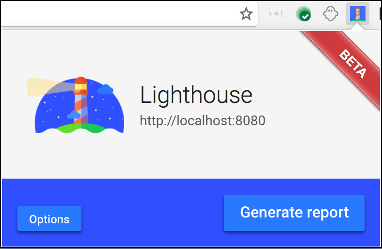
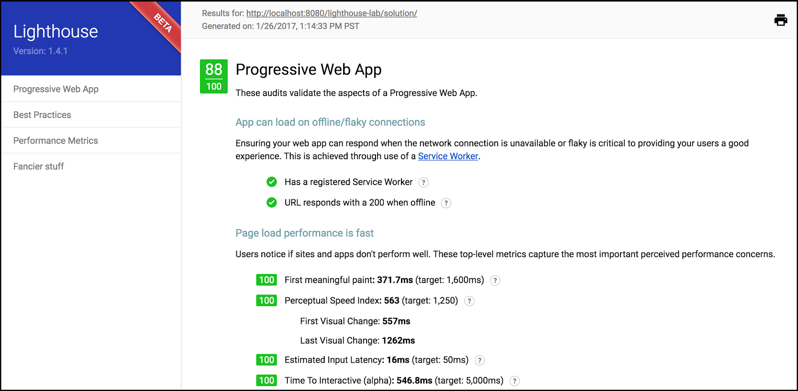

# Lighthouse PWA Analysis Tool

## Contents

[<strong>Introduction</strong>](#introduction)<strong>        </strong>

[<strong>Running Lighthouse as a Chrome extension</strong>](#extension)

[<strong>Running Lighthouse from the command line</strong>](#commandline)

Codelab:  [Auditing with Lighthouse](https://google-developer-training.gitbooks.io/progressive-web-apps-ilt-codelabs/content/docs/lab_auditing_with_lighthouse.html)

<a id="introduction" />

## Introduction

How do I tell if all of my Progressive Web App (PWA) features are in order?  [Lighthouse](https://github.com/GoogleChrome/lighthouse) is an open-source tool from Google that audits a web app for PWA features. It provides a set of metrics to help guide you in building a PWA with a full application-like experience for your users. 

Lighthouse tests if your app:

* Can load in offline or flaky network conditions
* Is relatively fast
* Is served from a secure origin
* Uses certain accessibility best practices

Lighthouse is available as a Chrome extension for Chrome 52 (and later) and a command line tool. 

<a id="extension" />

## Running Lighthouse as a Chrome extension

Download the Lighthouse Chrome extension from the  [Chrome Web Store](http://chrome.google.com/webstore/detail/lighthouse/blipmdconlkpinefehnmjammfjpmpbjk). 

When installed it places an   icon in your taskbar. 

Run Lighthouse on your application by selecting the icon and choosing <strong>Generate report</strong> (with your app open in the browser page).

Lighthouse generates an HTML page with the results. An example page is shown below. 

<strong>Note: </strong>You can test it out on an example PWA, <a href="https://www.airhorner.com/">airhorner.com</a>.

<a id="commandline" />

## Running Lighthouse from the command line

If you want to run Lighthouse from the command line (for example, to integrate it with a build process) it is available as a  [Node](https://nodejs.org/en/) module. 

You can download Node from  [nodejs.org](https://nodejs.org/en/) (select the version that best suits your environment and operating system). 

<strong>Note:</strong> You need the --harmony <a href="http://stackoverflow.com/questions/13351965/what-does-node-harmony-do">flag</a> with Node v5+ or Node v4.

To install Lighthouse's Node module from the command line, use the following command:

    npm install -g lighthouse

This installs the tool globally. You can then run Lighthouse from the command line (where  [https://airhorner.com/](https://airhorner.com/) is your app):

    lighthouse https://airhorner.com/

You can check Lighthouse flags and options with the following command:

    lighthouse --help

